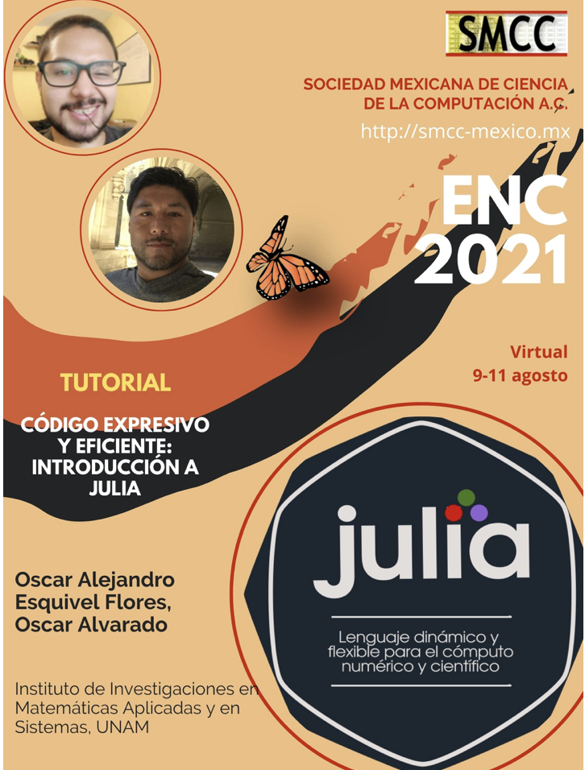

# Julia-ENC-2021

Actualmente, las ventajas que proporcionan los lenguajes de programación de alto nivel interpretados son eclipsadas por la poca eficiencia en la ejecución de algoritmos que requieren alta carga computacional, por otra parte, elegir lenguajes de bajo nivel compilados, veloces y eficientes, con sintaxis menos transparente y cuya curva de aprendizaje es intrincada representa un reto si se carece de experiencia previa. Lo anterior se traduce con frecuencia en la necesidad de combinar dos lenguajes de programación para desarrollar ágilmente prototipos de algoritmos y posteriormente implementar segmetos de código que ejecuten cálculos exhaustivos eficiencientemente. El lenguaje de programación Julia resuelve resuelve enfrenta y resuelve el problema del doble lenguaje al ofrecer herramientas que permiten manufacturar código claro, expresivo y eficiente. En poco tiempo Julia se ha posicionado como una herramienta ideal para científicos, tecnólogos, estudiantes y docentes interesados en desarrollar aplicaciones dirigidas al cómputo científico y de alto rendimiento.

El tutorial **Código expresivo y eficiente: Introducción a Julia** se presentó en el Encuentro Nacional de Computación ENC-2021, organizado por La Sociedad Mexicana de Ciencia de la Computación A.C., en los días 9-11 de Agosto de 2021. 

Atribuimos los créditos correspondientes de diversos ejemplos de código presentados durante el tutorial a múltiple colaboradores y entusiastas del lenguaje de programación Julia. Nuestra misión es estudiar, afinar y compartir el conocimiento e investigación sobre el lenguaje para ofrecer a estudiantes, profesores e investigadores una visión renovada sobre el cómputo científico.

Así mismo, este **trabajo es realizado gracias al PAPIIT-IA104720** que nos permite llevar acabo este intercambio de conocimiento Juliano.

### INSTRUCTORES:
Dr. Oscar Alejandro Esquivel Flores

C. Óscar Anuar Alvarado Morán

